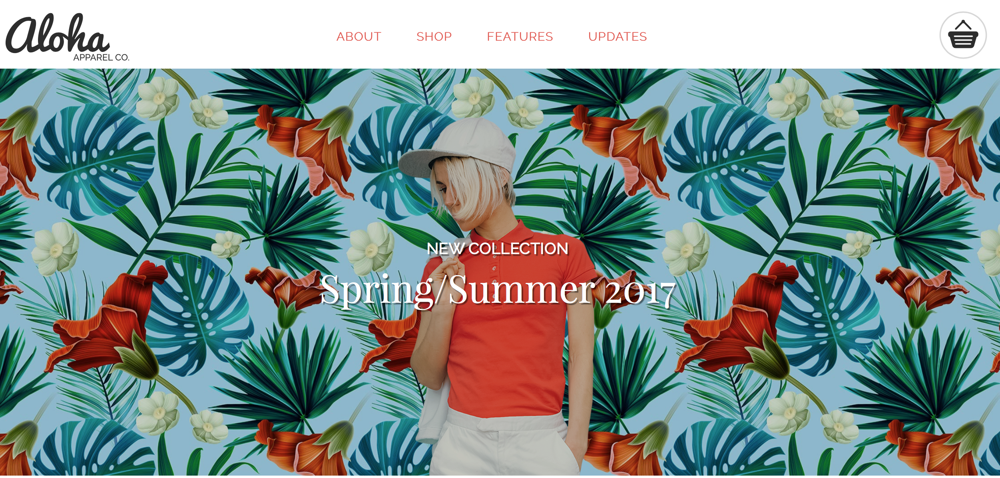

# Aloha
Red Academy Project 1

Copying by eye the Aloha! website as specified by the perameters of the project.

# Technologies Used
html5   CSS3    gulp    font-awesome    Transfonter   JavaScript    tota11y   flickity    github    jQuery

# The Site
Come shop at Aloha!  Find the outfit perfect for you.  We add new products all the time, so don't forget to sign up for our newsletter.
# Learnings
In this project I learned how to build a basic single-page website using primarily html5 and CSS with small snippets of javascript.  I learned the basic syntax of html and all the various tags I could use, apart from divs.

# Contributors
Camden Shaw